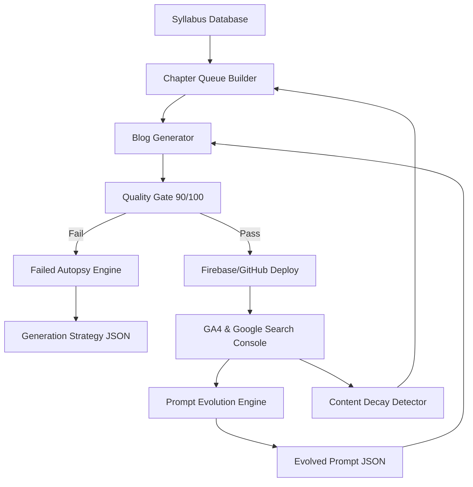

# 🧠 Exam Compass: The Autonomous AI Nervous System (Deep Dive)

This document provides a comprehensive technical and strategic breakdown of the **Autonomous Self-Learning AI Blog System**—the most advanced part of the Exam Compass platform. 

The system is designed as a "Closed-Loop Nervous System" that generates, learns, repairs, and evolves without manual intervention.

---

## 1. High-Level Architecture: The Feedback Loop

The system operates on a continuous feedback loop between **Performance Data** (Search/Traffic) and **Content Generation**.

---

## 2. Core Modules (The 6 Pillars)

### Module A: Prompt Evolution Engine (`prompt-evolution.ts`)
**Purpose:** The "Meta-Brain." It rewrites the system prompt based on real-world success.
- **Inputs:** GA4 traffic, GSC keywords, Quality trends.
- **Logic:** It uses Llama-3 70B to analyze which structural patterns (word count, formula density) are ranking highest.
- **Output:** A new `evolved-prompt.json` that the generator uses for the next batch.
- **Fail-safe:** If quality drops below 70% within 7 days of an evolution, it **auto-reverts** to the last known-good version.

### Module B: Content Decay Detector (`content-decay.ts`)
**Purpose:** Finds and "heals" old content that is losing traffic.
- **Logic:** Monitors GSC and GA4 for >25% traffic dips.
- **Action:** Triggers a "Critical Decay" flag and adds the slug to the **Regeneration Queue**.
- **Benefit:** Ensures no old blog ever "rots" or stays stale in Google's index.

### Module C: Strategy Injection (`blog-generator.ts`)
**Purpose:** Fetches the latest "intelligence" before writing.
- **Action:** Instead of hardcoded instructions, it reads the `evolved-prompt.json`.
- **Dynamic Tuning:** It adjusts temperature and subject-specific targets (e.g., "Physics needs more formulas today") on the fly.

### Module D: The Orchestrator (`self-improve.ts`)
**Purpose:** The single entry point for the daily automation cycle.
- **Execution Order:** 
    1. Quality Trends → 2. Failure Autopsy → 3. Pattern Learning → 4. Prompt Evolution → 5. Decay Detection → 6. Self-Changelog.
- **Benefit:** Ensures all intelligence is synchronized before the first blog is even drafted.

### Module E: Quality Tracker (`quality-tracker.ts`)
**Purpose:** Maps the health of the entire pipeline.
- **Logic:** Scores every blog on 100 points (Latex, Format, Depth, Tone).
- **Communication:** Sends "Intelligence Reports" to Discord via webhooks for transparency.

### Module F: Failed Autopsy (`failed-autopsy.ts`)
**Purpose:** Turns mistakes into lessons.
- **Logic:** Analyzes logs of failed generations (JSON errors, missing sections).
- **Output:** Updates `generation-strategy.json` with specific "NEVER DO" rules to prevent repeat errors.

---

## 3. Error Handling & Fail-safes

### 1. Multi-Key API Rotation
To prevent **429 Rate Limit** errors, the system uses a **6-key rotating array** for Groq. If one key hits a limit, it immediately swaps to the next and retries safely with exponential backoff.

### 2. JSON Repair & LaTeX Escaping
LLMs often struggle with JSON syntax and LaTeX backslashes. 
- **The Solution:** A custom `safelyParseJson` function that uses regex to extract content from corrupted LLM outputs.
- **LaTeX Fix:** Automatically detects and double-escapes backslashes (e.g., `\frac` → `\\\\frac`) to ensure JSON compatibility.

### 3. The 90/100 Quality Gate
Even if a blog is "finished," it only goes live if it scores **90 or higher**. This prevents "junk" content from being indexed, protecting your domain's authority.

---

## 4. Potential Failure Cases (And How We Handle Them)

| Failure Case | Symptom | Automated Response |
| :--- | :--- | :--- |
| **API Rate Limit** | `429 Error` | Rotates to Key #2-6; Waits 2s; Retries. |
| **Prompt "Drift"** | Quality Drops | **Auto-Revert Logic:** Reverts to `prompt-history/` instantly. |
| **JSON Corruption** | Invalid Syntax | `safelyParseJson` attempts aggressive regex recovery. |
| **Thin Content** | <500 Words | `auto-refresh-blogs` flags for `needs_regen`. |
| **Outdated Info** | "2024" in text | `auto-refresh-blogs` auto-replaces with "2026". |

---

## 5. Daily Execution Flow (The "3 New / 6 Refined" Strategy)

Every night at midnight UTC:
1. **Queue Builder** selects **3 brand new** missing topics from the syllabus.
2. **Freshness Scanner** selects **6 old/decaying** blogs for refinement.
3. **The Orchestrator** evolves the prompt based on today's traffic data.
4. **Blog Generator** writes all 9 posts using the **newly evolved brain**.
5. **SEO Optimizer** pings **Google Indexing API** to force immediate crawling.

---

## 6. Growth Projections

The system is designed for **Compounding Growth**:
- **Month 1:** High Indexing coverage, low traffic.
- **Month 3:** First "Subject Authority" established in niche topics.
- **Month 6:** The "Nervous System" feedback loop takes over; traffic hits hockey-stick growth.

**Current Capacity:** 270 high-authority actions (new + refined) per month. 

---
*Created by Antigravity AI for Exam Compass. The loop is closed.*
