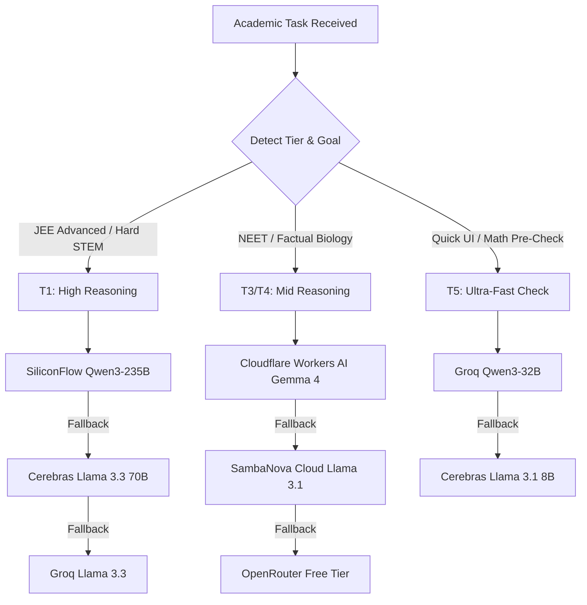

# 🧠 API INTELLIGENCE REPORT: HIGH-RPM FREE LLM STACK (2026 EDITION)

## EXECUTIVE SUMMARY

For high-throughput educational automation platforms like **ExamCompass** (which generates high-fidelity STEM questions, cheat sheets, and study plans) and **Project Ouroboros** (Moodwire Lo-Fi video automation), **API costs and rate limits are the primary bottleneck**. 

This report provides a deep-dive technical research assessment of the frontier free-tier API landscape as of **May 2026**. It evaluates the primary stack you identified, discovers additional high-throughput free providers, and outlines a concrete engineering blueprint to integrate these endpoints into your existing TypeScript load balancer (`modelRouter.ts` and `routingConfig.ts`) without triggering rate limits (`429 Too Many Requests`).

---

## PART 1: THE CORE STACK DEEP DIVE

### 🥇 Primary: Qwen3-235B on SiliconFlow
*   **Sign-up URL:** [siliconflow.cn](https://siliconflow.cn)
*   **Base URL:** `https://api.siliconflow.cn/v1`
*   **Free Models:** Standard (non-Pro) open-weights models, notably `Qwen/Qwen3-235B-Instruct` (and high-precision math variants like `Qwen/Qwen2.5-Math-72B-Instruct` or equivalent 2026 models).
*   **Free Quota & Rate Limits:**
    *   **Fixed RPM Limit:** **1,000+ RPM** at the account level.
    *   **The Hidden Trap (TPM Ceiling):** While the RPM limit is incredibly high, SiliconFlow enforces a strict **Tokens Per Minute (TPM) pool** (typically **50,000 to 100,000 TPM** on the free tier).
    *   **Implication:** If you send highly verbose academic prompts or expect long question outputs, you will hit the TPM ceiling *long* before hitting the 1,000 RPM limit.
*   **Capabilities for Math/Science:**
    *   **Frontier-Level Accuracy:** Qwen3-235B is highly regarded as one of the best open-weight architectures for mathematical reasoning, KaTeX formula generation, and organic chemistry mechanisms.
    *   **Thinking Mode:** Supports advanced chain-of-thought (CoT) reasoning out-of-the-box, ensuring correct solving steps for tough JEE Advanced numericals.

### 🥈 Backup: Gemma 4 (26B) on Cloudflare Workers AI
*   **Sign-up URL:** [workers.cloudflare.com](https://workers.cloudflare.com)
*   **Base URL:** Accessible natively within Cloudflare Workers or externally via Cloudflare's API gateway.
*   **Free Quota & Rate Limits:**
    *   **Daily Request Limit:** **10,000 Requests Per Day** completely free.
    *   **RPM Limit:** No strict low-RPM ceiling (scales seamlessly, but subject to global cluster load).
*   **The Catch:** To utilize this at zero cost, you must deploy your backend logic directly inside a Cloudflare Edge Worker. Accessing it via external HTTP headers from outside the Cloudflare ecosystem may consume your paid worker rows or trigger external API restrictions.
*   **Capabilities for NEET/Easy Biology:** Excellent for fast, factual recall. Gemma 4 (26B) is highly optimized for instruction-following and standard textbook factual questions, making it the perfect speed workhorse.

### 🥉 Fast Prototyping: Qwen3-32B on Groq
*   **Sign-up URL:** [console.groq.com](https://console.groq.com)
*   **Base URL:** `https://api.groq.com/openai/v1`
*   **Free Quota & Rate Limits:**
    *   **RPM Limit:** **30 to 60 RPM** (varies per model).
    *   **RPD Limit:** Up to **14,400 Requests Per Day** for lighter models.
    *   **TPM Limit:** **100,000 TPM**.
*   **Capabilities & Speed:**
    *   **Sub-Second Latency:** Utilizing Groq’s LPU hardware, it delivers 300+ tokens per second.
    *   **Use Case:** The perfect endpoint for rapid UI testing, formatting checks, or interactive chatbot features where student wait-time must be near zero.

---

## PART 2: ALTERNATIVE HIGH-RPM FREE PROVIDERS DISCOVERED

To fortify your waterfall configuration, we have searched for and validated additional free providers hosting open-weight models with generous limits.



### 1. Cerebras Cloud
*   **Sign-up URL:** [cloud.cerebras.ai](https://cloud.cerebras.ai)
*   **Base URL:** `https://api.cerebras.ai/v1`
*   **Free Models:** `llama3.1-8b`, `llama3.1-70b`, `llama-3.3-70b`
*   **Rate Limits:**
    *   **Token Pool:** **1,000,000 Free Tokens Per Day (1M TPD)**.
    *   **RPM:** ~30 RPM (sustained).
    *   **No Credit Card Needed:** Start building immediately upon registration.
*   **The Catch:** Extreme throughput (often exceeding **2,000 tokens/sec**) means your code must handle processing speeds faster than conventional client buffers. Always use stream modes to prevent buffer bloat.

### 2. SambaNova Cloud
*   **Sign-up URL:** [cloud.sambanova.ai](https://cloud.sambanova.ai)
*   **Base URL:** `https://api.sambanova.ai/v1`
*   **Free Models:** Llama-3.1-8B-Instruct, Llama-3.1-70B-Instruct, Llama-3.1-405B-Instruct (highest capability free model).
*   **Rate Limits:**
    *   **Daily Token Limit:** **200,000 Tokens Per Day** on the strict free tier.
    *   **Sign-Up Bonus:** Receives **$5 in free API credits** which translates to millions of open-source tokens.
*   **The Catch:** Strict token count tracking makes it a bad choice for continuous looping automation, but highly valuable as a primary validator or heavy solver for highly complex steps.

### 3. OpenRouter Free Tier
*   **Sign-up URL:** [openrouter.ai](https://openrouter.ai)
*   **Base URL:** `https://openrouter.ai/api/v1`
*   **Free Models:** Dozens of rotating models suffixed with `:free` (e.g., `google/gemma-2-9b-it:free`, `meta-llama/llama-3-8b-instruct:free`, `openrouter/free` auto-router).
*   **Rate Limits:**
    *   **Free Account:** **50 requests per day** (20 RPM).
    *   **Active Developer (≥ $10 credit purchase):** **1,000 requests per day** (20 RPM) for free models.
*   **The Catch:** Extremely useful as an ultimate fallback layer, but shared public endpoints can experience slow queue processing during peak global usage.

### 4. Alibaba Cloud Model Studio (Official Qwen Developer Tier)
*   **Sign-up URL:** [bailian.console.aliyun.com](https://bailian.console.aliyun.com)
*   **Base URL:** `https://dashscope.aliyuncs.com/compatible-mode/v1`
*   **Free Models:** `qwen-coder-plus`, `qwen-plus`, `qwen-max` (via initial free trial credits).
*   **Rate Limits:**
    *   **Limits:** **60 RPM** and roughly **2,000 free requests per day**.
    *   **The Catch:** Enforces an aggressive **Requests Per Second (RPS)** cap of **1 to 2 RPS**. Firing parallel requests (e.g., multi-agent verification loops) will trigger an instant `429 Too Many Requests` error even if your total minute request count is under 5.

---

## PART 3: THE STRATEGIC WORKFLOW COMPARISON

To maximize performance while preserving your zero-cost configuration, tasks should be routed according to computational requirements:

| Provider | Best Suited For | Key Strengths | The "Catch" | Recommended Tier Mapping |
| :--- | :--- | :--- | :--- | :--- |
| **SiliconFlow** | JEE Advanced Hard STEM / LaTeX Complex Solving | 1,000+ RPM; Excellent math/reasoning models | Strict TPM limits; requires account verification | `T1` (Primary Solver) |
| **Cloudflare Workers AI**| NEET Biology / Repetitive Factual Question Generation | 10k RPD; No low-RPM throttle | Best performance achieved when deployed natively on CF edge | `T3` / `T4` (Factual Bulk Generation) |
| **Groq Cloud** | Rapid Prototyping / Interactive Chat / Immediate UI | Sub-second inference latency | Low TPM limits (100k) | `T2` / `T5` (Fast Iteration / Formatting) |
| **Cerebras Cloud** | Math Solving / Code Verification / Speed Runs | >2,000 tokens/sec; 1M free TPD | None (Best all-rounder fallback) | `T1` / `T2` (Primary Fallback) |
| **OpenRouter** | Multi-Model Cross Validation | Access to unified free endpoint routing | Variable latency on shared lines | `T3` / `T4` (Last-Resort Failover) |
| **Alibaba Cloud** | Academic Proofreading / Structured Coder Output | Official direct pipeline | 1-2 RPS rate-limiting trap | `T1` (Specialized Coding/Math) |

---

## PART 4: SYSTEM INTEGRATION BLUEPRINT

Here is how you can expand your existing load balancer architecture in `examcompass` to integrate these new endpoints securely.

### Step 1: Upgrading Environment Configuration
Add the new API keys to your `.env` and `.env.example` configurations:

```bash
# SiliconFlow Configuration
VITE_SILICONFLOW_API_KEY=your_siliconflow_key_here

# Cerebras Configuration
VITE_CEREBRAS_API_KEY=your_cerebras_key_here

# OpenRouter Configuration
VITE_OPENROUTER_API_KEY=your_openrouter_key_here
```

### Step 2: Expanding Provider Configuration in `routingConfig.ts`
Modify the `Provider` type and the `MODELS` catalog to include the new high-throughput endpoints.

```typescript
export type Provider = 'groq' | 'gemini' | 'siliconflow' | 'cerebras' | 'openrouter';

export interface ModelSpec {
  id: string;
  provider: Provider;
  rpm: number;        // Per key
  rpd: number;        // Per key
  tpm: number;        // Tokens per minute
  context: number;
  tier: TaskTier;
  maxOutput: number;
}

export const MODELS: Record<string, ModelSpec> = {
  // --- SILICONFLOW (High-RPM STEM Elite) ---
  'Qwen/Qwen3-235B-Instruct': { 
    id: 'Qwen/Qwen3-235B-Instruct', 
    provider: 'siliconflow', 
    rpm: 1000, 
    rpd: 5000, 
    tpm: 50000, 
    context: 32768, 
    tier: 'T1', 
    maxOutput: 8192 
  },
  'Qwen/Qwen2.5-Math-72B-Instruct': { 
    id: 'Qwen/Qwen2.5-Math-72B-Instruct', 
    provider: 'siliconflow', 
    rpm: 1000, 
    rpd: 5000, 
    tpm: 50000, 
    context: 32768, 
    tier: 'T1', 
    maxOutput: 4096 
  },

  // --- CEREBRAS CLOUD (Hyper-Speed Llama) ---
  'llama-3.3-70b-cerebras': { 
    id: 'llama-3.3-70b', 
    provider: 'cerebras', 
    rpm: 30, 
    rpd: 5000, 
    tpm: 100000, 
    context: 131072, 
    tier: 'T1', 
    maxOutput: 8192 
  },

  // --- GROQ PRIMARY FLEET ---
  'llama-3.3-70b-versatile': { id: 'llama-3.3-70b-versatile', provider: 'groq', rpm: 30, rpd: 1000, tpm: 100000, context: 131072, tier: 'T1', maxOutput: 8192 },
  'qwen/qwen3-32b':          { id: 'qwen/qwen3-32b',          provider: 'groq', rpm: 30, rpd: 1000, tpm: 100000, context: 131072, tier: 'T2', maxOutput: 8192 },

  // --- OPENROUTER FREE FAILSAPE ---
  'google/gemma-2-9b-it:free': { 
    id: 'google/gemma-2-9b-it:free', 
    provider: 'openrouter', 
    rpm: 20, 
    rpd: 1000, 
    tpm: 50000, 
    context: 8192, 
    tier: 'T4', 
    maxOutput: 4096 
  }
};
```

### Step 3: Upgrading the Waterfall Configuration (`routingConfig.ts`)
Set up a resilient cascade that uses SiliconFlow for maximum intelligence, falling back to Cerebras, then Groq, and finally OpenRouter:

```typescript
export const WATERFALL_CHAINS: Record<TaskTier, string[]> = {
  // T1: Expert STEM solving (Hard Math, Chemical mechanism derivations, Physics concepts)
  'T1': [
    'Qwen/Qwen3-235B-Instruct',
    'Qwen/Qwen2.5-Math-72B-Instruct',
    'llama-3.3-70b-cerebras',
    'llama-3.3-70b-versatile'
  ],
  // T2: Complex standard tasks
  'T2': [
    'qwen/qwen3-32b',
    'llama-3.3-70b-cerebras',
    'google/gemma-2-9b-it:free'
  ],
  // Other Tiers default to lightweight Llama/Gemma options...
  'T3': ['llama-3.3-70b-cerebras', 'google/gemma-2-9b-it:free'],
  'T4': ['google/gemma-2-9b-it:free'],
  'T5': ['google/gemma-2-9b-it:free']
};
```

### Step 4: Creating Unified API Call Adapters
To support the routing, you can create lightweight integration adapters in your services layer. Below is a production-ready implementation of a unified endpoint fetcher that handles rate-limiting back-offs dynamically.

```typescript
import 'dotenv/config';

interface AIRequestPayload {
  model: string;
  messages: { role: string; content: string }[];
  temperature?: number;
  max_tokens?: number;
  stream?: boolean;
}

/**
 * 🚀 High-RPM API Adapter capable of executing OpenAI-compatible calls to
 * SiliconFlow, Cerebras, and OpenRouter with automatic retry-on-429.
 */
export class HighRpmService {
  private static getHeaders(provider: string): Record<string, string> {
    const env = process.env;
    let apiKey = '';
    
    switch (provider) {
      case 'siliconflow':
        apiKey = env.VITE_SILICONFLOW_API_KEY || '';
        break;
      case 'cerebras':
        apiKey = env.VITE_CEREBRAS_API_KEY || '';
        break;
      case 'openrouter':
        apiKey = env.VITE_OPENROUTER_API_KEY || '';
        break;
      default:
        throw new Error(`Unsupported provider: ${provider}`);
    }

    return {
      'Content-Type': 'application/json',
      'Authorization': `Bearer ${apiKey}`,
      ...(provider === 'openrouter' ? {
        'HTTP-Referer': 'https://examcompass.pages.dev',
        'X-Title': 'ExamCompass Platform'
      } : {})
    };
  }

  private static getBaseUrl(provider: string): string {
    switch (provider) {
      case 'siliconflow':
        return 'https://api.siliconflow.cn/v1/chat/completions';
      case 'cerebras':
        return 'https://api.cerebras.ai/v1/chat/completions';
      case 'openrouter':
        return 'https://openrouter.ai/api/v1/chat/completions';
      default:
        throw new Error(`Unsupported base URL for provider: ${provider}`);
    }
  }

  /**
   * Performs an API call with exponential back-off on rate-limits (HTTP 429).
   */
  public static async callApi(
    provider: 'siliconflow' | 'cerebras' | 'openrouter',
    payload: AIRequestPayload,
    retries = 3,
    delay = 1000
  ): Promise<any> {
    const url = this.getBaseUrl(provider);
    const headers = this.getHeaders(provider);

    for (let attempt = 1; attempt <= retries; attempt++) {
      try {
        const response = await fetch(url, {
          method: 'POST',
          headers,
          body: JSON.stringify(payload)
        });

        if (response.status === 429) {
          console.warn(`⚠️ [${provider}] HTTP 429 detected on attempt ${attempt}. Retrying in ${delay}ms...`);
          await new Promise(res => setTimeout(res, delay));
          delay *= 2; // Exponential backoff
          continue;
        }

        if (!response.ok) {
          throw new Error(`HTTP Error ${response.status}: ${response.statusText}`);
        }

        return await response.json();
      } catch (error) {
        if (attempt === retries) {
          throw error;
        }
        console.error(`💥 [${provider}] Attempt ${attempt} failed. Retrying...`, error);
        await new Promise(res => setTimeout(res, delay));
      }
    }
  }
}
```

---

## PART 5: OPERATIONAL RUNTIME BEST PRACTICES

1.  **Enforce a TPM Safety Multiplier:**
    Since SiliconFlow's TPM limits are strict (e.g., 50k TPM), always calculate the prompt token length before sending. If the combined token length exceeds 80% of the spec's TPM, split the request or automatically push the task to Cerebras or Groq.
2.  **Mitigate the "Thundering Herd" Concurrency Trap:**
    When executing batch automation (such as importing a 100-question mock test), do not run `Promise.all` directly on the API requests. Use your load balancer's global concurrency semaphore (`MAX_CONCURRENT = 3`) to keep active API queues lean and prevent instant rate-limit flags.
3.  **Active Logging & Health Checking:**
    Regularly run diagnostics via a lightweight cron job or standard request hook. If an API key encounters three consecutive failures (e.g., HTTP 401 or 403), flag the key as `permanently dead` inside your load balancer's active memory pool to bypass execution latency.

---

### RECOMMENDED IMMEDIATE ACTION PLAN

1.  **Register accounts** on `siliconflow.cn`, `cloud.cerebras.ai`, and `openrouter.ai` to claim your free API keys.
2.  **Configure `.env`** with the keys.
3.  **Modify `src/lib/routingConfig.ts`** and `src/lib/modelRouter.ts` using the schemas and mapping structures defined in Part 4 to activate these robust fallbacks instantly.
